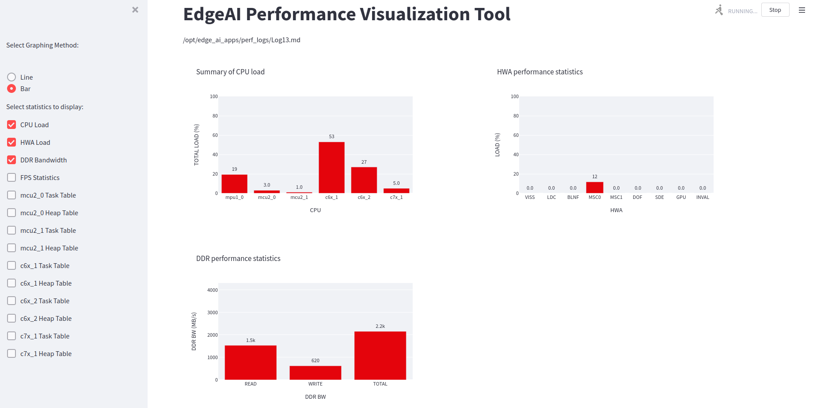

.. _pub_edgeai_perf_viz_tool:

==============================
Performance Visualization Tool
==============================

The performance visualization tool can be used to view all the performance
statistics recorded when running the edge AI C++ demo application. This
includes the CPU and HWA loading, DDR bandwidth and FPS obtained. Refer to
:ref:`pub_edgeai_available_statistics` for details on the performance
metrics available to be plotted.

The edge AI C++ demo will generate log files and store them in the directory
``../perf_logs``, that is, one level up from where the C++ app is run. For
example, if the app is run from ``edge_ai_apps/apps_cpp``, the logs will be
stored in ``edge_ai_apps/perf_logs``.
Each log file contains real-time values for some performance metrics, averaged
over a 2s window. The performance visualization tool then parses these log
files one by one based on the modification timestamps, and plots the performance
metrics to be viewed in any browser. This can be run in parallel with the edge AI
C++ demo application or offline after having generated the log files.

.. note::

    While the log files are always generated when running the C++ demo, the
    performance visualization tool can only be run inside Docker environment
    for the current release. Please refer to :ref:`pub_edgeai_docker_env` for
    building and running a docker container.

Running the tool
================

To use this tool, simply start a docker session and then run the
command given below. This script expects some log files to be present in
the directory ``edge_ai_apps/perf_logs`` after running any C++ demo. One can
also bring up this tool while running the demo but it might affect the performance
of the demo itself as it consumes a bit of ARM cycles during launch but stabilizes
over a certain duration.

.. code-block:: bash

    [docker] root@j7-evm:/opt/edge_ai_apps# streamlit run scripts/perf_vis.py --theme.base="light"

This script also accepts the log directory as a command line argument as follows:

.. code-block:: bash

    [docker] root@j7-evm:/opt/edge_ai_apps# streamlit run scripts/perf_vis.py --theme.base="light" -- -D <path/to/logs/directory/>

A network URL can be seen in the terminal output. The graphs can be viewed by
visiting this URL in any browser. The plotted graphs will keep updating based
on the available log files.

    Performance visualizer dashboard showing CPU and HWA loading and DDR bandwidth

To exit press Ctrl+C in the terminal.

.. _pub_edgeai_available_statistics:

Available options
=================

Using the checkboxes in the sidebar, one can select which performance metrics to
view. There are 14 metrics available to be plotted, as seen from the above image:

    - CPU Load: Total loading for the A72(mpu1_0), R5F(mcu2_0/1), C66x(c6x_1/2) and C71x(c7x_1) DSPs.
    - HWA Load: Loading (percentage) for the various available hardware accelerators.
    - DDR Bandwidth: Average read, write and total bandwidth recorded in the previous 2s interval.
    - FPS Statistics: Average frames per second recorded by the application.
    - Task Table: A separate graph for each cpu showing the loading due to various tasks running on it.
    - Heap Table: A separate graph for each cpu showing the heap memory usage statistics.

For the first four metrics, there is a choice to view line graphs with a 30s history
or bar graphs with only the real-time values. The remaining ten have real-time bar
graphs as the only option.